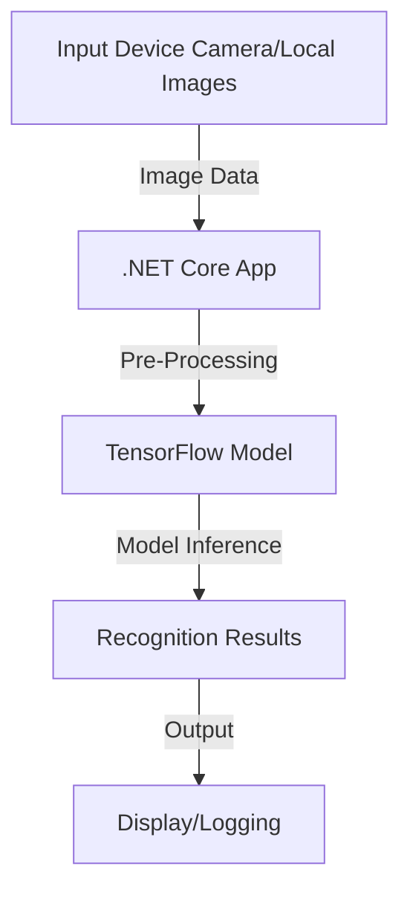

# PoC .NET Tensorflow

A proof of concept (PoC) to demonstrate the integration of .NET Core and TensorFlow for real-time image recognition.

---

## Introduction

This project showcases the power of .NET Core combined with TensorFlow to perform real-time image recognition. Using TensorFlow's model inference capabilities, the PoC allows users to process images and identify objects in real-time.

The implementation is inspired by [Paulo Torres' Medium article](https://medium.com/@paulotorres/real-time-image-recognition-with-net-core-and-tensorflow-5b03743e0116), with enhancements to demonstrate practical use cases.

---

## Diagram



---

## Features

- **Real-Time Image Processing:** Capture images from a live camera feed or load pre-saved images.
- **TensorFlow Integration:** Leverage TensorFlow models for accurate object detection.
- **Platform Independence:** Built using .NET Core for cross-platform support.
- **Extensible Design:** Easy to integrate with different TensorFlow models and extend for additional functionality.

---

## Useful Links

- [Real-Time Image Recognition with .NET Core and TensorFlow (Medium Article)](https://medium.com/@paulotorres/real-time-image-recognition-with-net-core-and-tensorflow-5b03743e0116)
- [TensorFlow Official Documentation](https://www.tensorflow.org/)
- [.NET Core Documentation](https://learn.microsoft.com/en-us/dotnet/core/)

---

## How to Run

1. **Clone the repository:**
   ```bash
   git clone https://github.com/your-repository-url.git
   cd your-repository-folder
   ```

2. **Install prerequisites:**
   - Ensure you have .NET Core SDK installed ([Download](https://dotnet.microsoft.com/)).
   - Install TensorFlow runtime for your platform.

3. **Restore dependencies:**
   ```bash
   dotnet restore
   ```

4. **Build the project:**
   ```bash
   dotnet build
   ```

5. **Run the application:**
   ```bash
   dotnet run
   ```

6. **Usage:**
   - Provide an image input (via file or live camera feed).
   - Observe real-time recognition results in the console or UI.

---

## License

This project is licensed under the MIT License. See the [LICENSE](LICENSE) file for details.
## Pixeebot Activity Dashboard

This repository integrates with the Pixeebot Activity Dashboard to provide real-time insights on repository activity.


### Highlights
- Nice work, you're all caught up!
- Monitoring PRs continuously.
